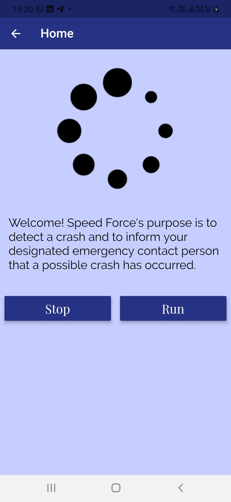
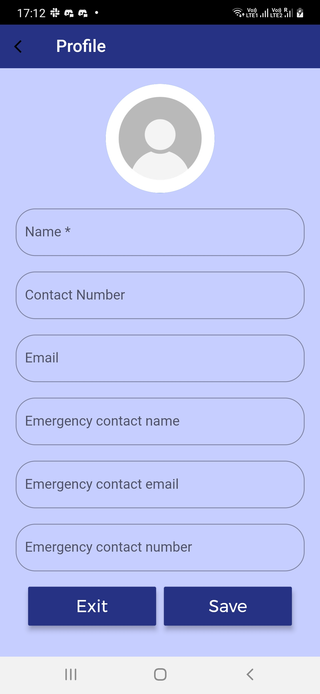
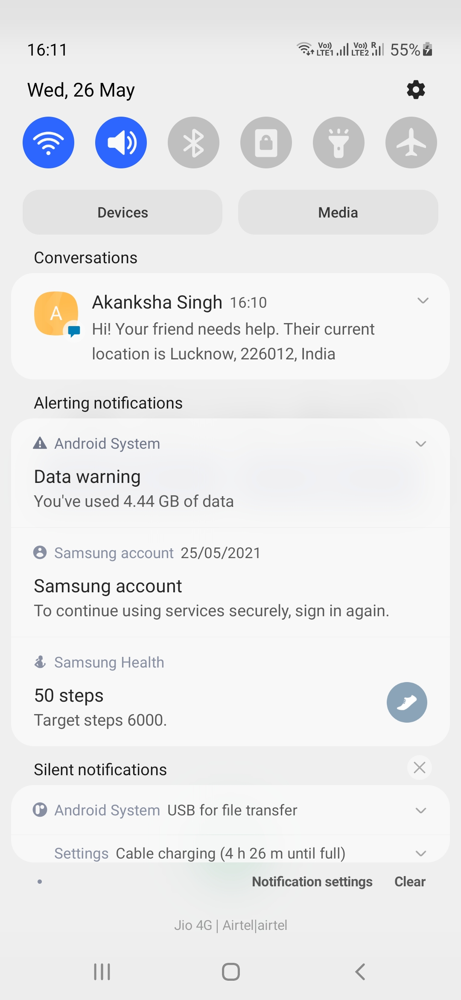
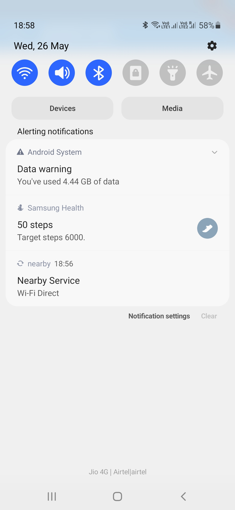

# Speed_Force

A car crash reporting tool for your emergency contact and nearby users

**Speed Force** purpose is to detect a crash and to inform your designated emergency contact person that a possible crash has occurred. While similar tools exist, to our knowledge the nearby contacts feature is not incorporated.

Speed Force will send a prompt to nearby users informing them of a possible accident nearby and if they are willing to assist, in addition to the emergency contact.
  
This tool is meant to be used in a community setting to support each other. Maybe at a busy intersection with local business or a sport team traveling, or maybe just getting groceries for loved ones.

## TechStack
- Flutter
- Ruby
- Ruby on Rails

 ## How it works?
  
When the user opens the app they get two options "Stop" and "Run". The app runs in the background if user clicks on "Run". It uses Sensor plugin and gets accelerometer readings. Then it keeps on calculating gforce and when this gforce crosses threshold gforce which happens in the case of accident then the app asks user if they are okay and if the user doesn't reply within 15-20 seconds then a message with gps location is sent to the added emergency contact. We also considered the case in which phone gets damaged so as soon as the gforces crosses threshold the app send gps location of the user to emergency contact. 
  
## Link to project demo : https://youtu.be/rzm_c_raNKc
  
  

# Screenshots
<pre>
    
</pre>
